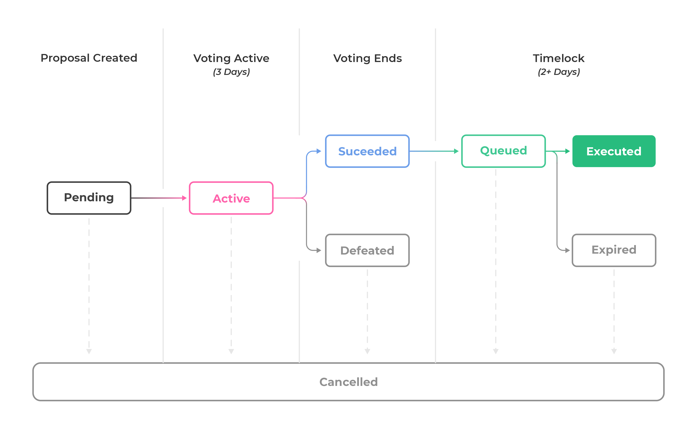

# USDAO Governance Protocol

Inspired by the Compound governance protocol, we developed a decentralized governance architecture that is aimed to serve as the sole decision-making body for future changes in the USDAO stablecoin system. This is important to make the USDAO protocol a completely decentralized system with no single individual or institution having full control over it.&#x20;

Depending upon the changes we face in the future it is important to have features that allow necessary changes to be made for the welfare of the stablecoin. However, when the world is moving towards complete decentralization we didn’t want to be left behind. Hence, we decided to build this decentralized governance system.&#x20;

DAOGOV is the governance token of the USDAO ecosystem.
