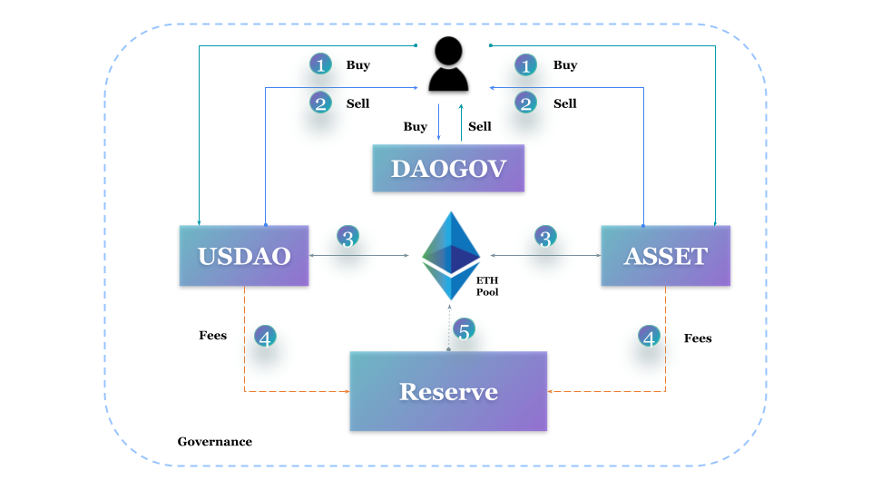

# How it works

## USDAO stablecoin: How it works

The USDAO stable coin is designed to be pegged to 1 US dollar, and provides a minting ratio of 1:1 with the dollar.&#x20;

The USDAO stable coin is designed to be pegged to 1 US dollar, and which provides users with the ability to mint USDAO stablecoins at a 1:1 ratio with the dollar.&#x20;

The two operations, mint and burn, help it maintain its peg. When either of these two activities increases more than the other the USDAO mint or burn price rises up or falls down slightly in order to discourage any more such operations.&#x20;

Two operations, mint and burn are available for users. When a user wishes to exchange ETH (or in the future other forms of cryptocurrency for collateral) for a stablecoin, they use the Mint (buy) function, and conversely when they wish to return back to crypto they burn (sell) their USDAO stablecoins.&#x20;

However, ideally in stable market conditions, if a user deposits x dollar worth of Ether into the system he shall receive x amount of USDAO stable coins. Conversely, if a user deposits x amount of stable coins back into the system he shall receive x US dollar worth of Ether back in his wallet.&#x20;

When either of these two activities (mint or burn) increases more than the other, the USDAO mint or burn price rises up or falls down slightly in order to discourage any more such operations.&#x20;

The prices for all such operations are determined by the median price of three oracles - Chainlink Eth/USD price, Uniswap V2, and Compound oracle.

However, ideally in stable market conditions, if a user deposits x dollar worth of Ether into the system he shall receive x amount of USDAO stable coins.&#x20;

Conversely, if a user deposits x amount of stable coins back into the system he shall receive x US dollar worth of Ether back in his wallet. The prices for all such operations are determined by the median price of three oracles - Chainlink Eth/USD price, Uniswap V2, and Compound oracle.

Since the price of Ether is constantly volatile it is required to maintain the US dollar value of the USDAO pool always greater than the number of stablecoins (USDAO) out in the market.&#x20;

This is made possible by the second token called the ASSET token. ASSET tokens allow investors to fund the system with Ether (ETH) to keep the system always healthy. Similar to USDAO, the holders of ASSET tokens can also buy and sell their tokens.&#x20;

However, the ASSET token is a token that assumes the risks and harvests the benefits. It gives investors a unique opportunity to not only scale their profit but also earn a share in the revenue.

ASSET tokens allow investors to fund the system with Ethers to keep the system always healthy. Similar to USDAO, the holders of ASSET tokens can also buy (or fund) and sell (or defund) their tokens. However, the ASSET token is a token that assumes the risks and harvests the benefits. It gives investors a unique opportunity to not only scale their profit but also earn a share in the revenue.

The exchange rate for the above operation is also determined by the set of three oracles, namely Chainlink, UniSwap V2 and Compound.&#x20;

USDAO can be used for everyday means of exchange, a store of value, market entry, and most commonly, to provide a less volatile holding ground for investors and traders during the upswings and retracements in the cryptocurrency market.
