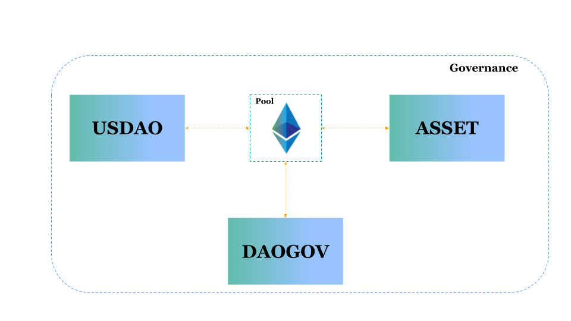

# Introduction

The motivation to develop a stable coin like USDAO is to build an enterprise-friendly, easily integrable, and interoperable stable coin that should not only be as reliable as fiat currencies in the current market but also open new doors of possibilities for businesses using blockchain technology. We share the pain of lack of any such solution despite the market being flooded with hundreds of stable coin projects. We intend to provide a solution to this problem.&#x20;

We, at USDAO Foundation, have built a stable coin that would simplify the business processes and extend support for global transactions by offering faster and safer solutions, larger transaction volumes, decentralized governance, and many more advantages than both our centralized and decentralized competitors. We promise to offer simpler implementation and easy integration of our technology into your existing businesses. USDAO is powered by multiple blockchains including Ethereum which is itself a reputed and established market leader in decentralized applications technology.

Crypto assets are known for their high volatility which rendered them unsuitable as a medium of exchange. A stable cryptocurrency strives to become a medium of exchange by suppressing volatility and maintaining a constant value through time. This innovation allows individuals and businesses to enter into future agreements at a known cost. Just as one US Dollar today is equal to one dollar tomorrow, people can transact knowing they will have a certain fixed cost.

Multi-Collateral USDAO is the next and full version of the USDAO Stablecoin System. In this system, all ERC-20 tokens are capable of being used as collateral for USDAO. Governance token (DAOGov) holders will be responsible for voting in and setting risk parameters for each collateral type. The scope of collateral types is quite wide as tokens issued on the Ethereum platform. In addition to it USDAO protocol will be available on all the major blockchains.

In order to create a stable coin that meets the requirements of varied businesses and enterprises, it is important that not only it is competent enough against traditional solutions but also present significant improvements over them. We offer USDAO stable coin as a solution designed to keep simplicity, interoperability, and business compatibility at its core. Integrating USDAO as a payment channel into your existing business or enterprise is simpler than the leading payment solutions available today. All you need is a blockchain wallet with an account to send and receive payments in USDAO to get started. The process is simpler compared to traditional solutions which include registrations, KYC, complex integrations, and high transaction fees.

The USDAO pool mechanism assures that the pool never gets undercollateralized and users are never threatened of forced liquidation. Above all, unlike its rivals, USDAO comes up with an ecosystem of use cases. The USDAO stable coin is one crucial element to the financial architecture we are building.

The details of such use cases are mentioned in the respective sections below. With the presence of USDAO on multiple blockchains and combining its interoperability and compatibility, it becomes a one-stop destination for truly decentralized robust, safe and secure financial solutions that are industry-ready. Before moving onto the USDAO workflow let’s dive into some of its important and crucial components and terminologies. All prices are denominated in ether. These prices are computed by consulting ETH/USD price oracles, except when otherwise stated. Since the stable coin is deployed on multiple blockchains the keyword ERC20 is used in a general form. Every such statement is true for all the other protocols like BEP20 or TRC20 for Binance Smart Chain and Tron respectively.
