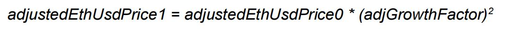

# ASSET FUND

### The formula for Asset token price is,

$$
Asset token price = (ethPoolUSDValue - usdaoQty / effectiveEthUsdPrice) / assetQty
$$

Where,&#x20;

ethPoolUSDValue = Total USD value of Eth pool&#x20;

usdaoQty = Total USDAO supply in circulation&#x20;

effectiveEthUsdPrice = Current trade price&#x20;

assetQty = Total Asset tokens supply

### Concept of underwater and usmSupplyForFumBuys

When the debt ratio crosses MAX\_DEBT\_RATIO (i.e 80%) the system is said to be underwater. At this moment defunding is disabled.&#x20;

Since the price of Asset token is dependent on the total supply of USDAO calculation the definition of USDAO supply changes when the system is underwater. We will call this USDAO supply to calculate Asset token price usmSupplyForFumBuys.

When the debt ratio is <= MAX\_DEBT\_RATIO

$$
usmSupplyForFumBuys = Actual total supply of USDAO
$$

In this case, suppose the system currently contains 50 ETH at price $1,000 (total pool value: $50,000), with an actual USDAO supply of 30,000 USDAO. Then debt ratio = 30,000 / $50,000 = 60%: < MAX 80%, so `usmSupplyForFumBuys` = 30,000.

Now suppose ETH/USD halves to $500. Then pool value halves to $25,000, and debt ratio doubles to 120%. Now `usmSupplyForFumBuys` instead = 20,000: the USDAO quantity at which debt ratio would equal 80% (20,000 / $25,000).

However, with time the quantity of usmSupplyForFumBuys is increased so that the price of Asset tokens decreases and investors are incentivized to buy it. Let’s understand how this happens.

Let’s say when the debt ratio hit 80% the usmSupplyForFumBuys was 20,000. Let’s assume the actual total USDAO in circulation is 25000. Assuming the half-life (rate of increase in the supply of usmSupplyForFumBuys) be 1 day so three days after going underwater, the supply returned will be 25,000 - 0.5_\*3 _ (25,000 - 20,000) = 24,375.

If the output was greater than 25000 it would be capped to 25000 because usmSupplyForFumBuys cannot be greater than the actual supply of USDAO.

So at any point in time, the price of the Asset token is calculated using the formula above. The only thing that varies in the formula is we use actual USDAO total supply if the system is not underwater else we use usmSupplyForFumBuys for calculating Asset token price.

So coming back to our \_fundFum function, we first fetch the latest data like ethUsdPrice, bidAskAdjustment, etc from loadState function and refresh these values using the latest Oracle prices returned.

When we called loadState function it returned the eth pool value which also includes the ether that we sent just now for fund operation. In order to calculate the correct debt ratio and prices, we deduct this ether value from the total eth pool value. Let’s call this ethPool0.

So,

$$
ethPool0 = total ether in pool - ether just received for fund operation
$$

We then check if the pool is underwater i.e if the debt ratio > MAX\_DEBT\_RATIO (80%). As mentioned above, the checkIfUnderwater returns the amount of ethers in the pool, ETH/USD price, and most importantly the effective total supply of USDAO which will be used to calculate our Asset token price.

### Calculating Output ASSET Tokens From Fund

Having determined effective USDAO supply, Asset total supply, ETH/USD price, and debt ratio we can now calculate how many Asset tokens we can receive from this fund operation.

### Calculate adjusted ETH USD price

By default, the price is equal to the oracle price. However, if the bidAskAdjustment is greater or lower than WAD i.e if buys are happening more than sells or vice versa the price is multiplied with the bidAskAdjustment factor. The multiplication used is a WAD multiplication and hence if it's a buy the product output is rounded up else down. See WAD operations docs.

### Calculating the Fum price (Asset price) based on the adjusted ETH/USD price

$$
If total supply of asset token is 0 the asset price defaults to 1 USD
$$

I.e Asset token price = WAD / EthUsdPrice

If the total supply of Asset tokens > 0 we calculate the buffer (USD value of Ethpool - total USDAO supply)

### Calculating Buffer

To calculate buffer we determine USDAO value in eth terms,

$$
usmValueInEth = usmSupply / ethUsdPrice
$$

Where,

**ethUsdPrice = trade price, usmSupply = total supply of USDAO**

Hence,&#x20;

**Buffer = amount of ether in pool - usmValueInEth**

Now that we have determined the buffer amount, let’s come back to determining our ASSET price. If the buffer is less than equal to 0 the ASSET price is 0 else it's the quotient of (buffer / total ASSET supply) i.e

**If buffer <= 0, fum price = 0**

**If buffer > 0, ASSET price = buffer / total ASSET supply**

Let’s call this ASSET price fumBuyPrice0 and let’s come back to determine how many ASSET tokens we should receive for the calculated ASSET price above.

If there are no ethers in the pool, our bidAskAdjustment = WAD (i.e 1) and output asset token is simply the quotient of ether inserted and ASSET price i.e

**If amount of ether in pool == 0,**

**assetOut = ethIn / assetBuyPrice0**

If the pool contains some ether already we follow a different path to calculate the output asset. Just like mint operation, the **asset** price grows during a fund operation. However, in fund operation, the ether deposited is a leveraged ether so fund operation should increase the price more than a mint operation should. This factor is called the net ASSET delta factor which is the factor by which this operation will move the ETH price more than a simple mint() operation would.

**Let effectiveDebtRatio0 be a min of either the current debt ratio or the MAX\_DEBT\_RATIO (80%)**

#### i.e effectiveDebtRatio0 = min(current\_debt\_ratio, MAX\_DEBT\_RATIO)

#### So, netFumDelta = effectiveDebtRatio0 / ( 1 - effectiveDebtRatio0 )

This is basically the ratio of amount of change this fund operation is incurring on the debt ratio of the pool.

### Calculating adjGrowthFactor

Using this netASSETDelta, we now determine the new adjGrowthFactor which is basically how much the ASSET price should be impacted from this fund operation. Let's call this impact adjGrowthFactor.

**So, adjGrowthFactor =**

.jpg>)

Now that we know how much price impact this fund operation is going to make we finally calculate the adjustedEthUsdPrice1 which is the price at which these asset tokens will be minted from the supplied input ether.

As discussed above the price from fund operation should move more up than a mint operation hence, we calculate and adjusted ETH/USD price based on our previous adjusted ETH/USD price and new adjGrowthFactor.

The square above is a WAD square

So now we have a new adjusted EthUsdPrice, hence we calculate the new asset buy price similarly as we calculated fumBuyPrice0. Let’s call this new asset price assetBuyPrice1.

Taking the geometric mean of assetBuyPrice0 and assetBuyPrice1 we get,

.jpg>)

Finally, output asset tokens equal to,

$$
assetOut = input ether / avgAssetBuyPrice
$$

